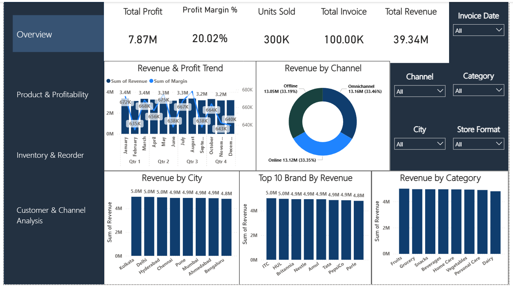
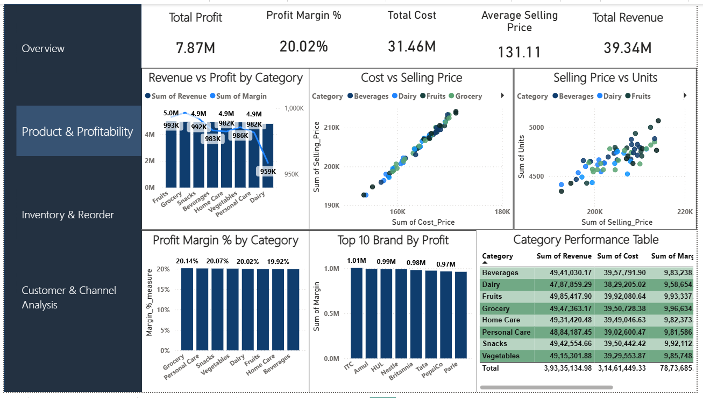
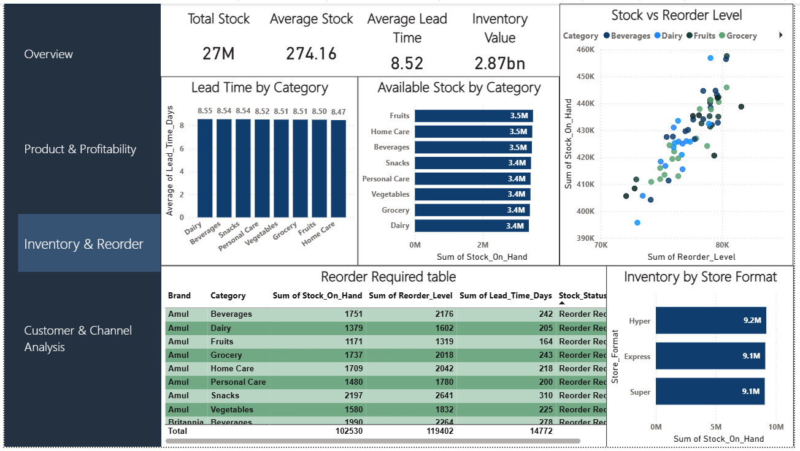

# Retail FMCG Sales & Customer Inventory Dashboard

## 📊 Project Overview

This project is an interactive **Retail FMCG Sales & Customer Inventory Dashboard** developed using **Microsoft Power BI**.

The objective was to transform retail data into an interactive dashboard that provides insights into sales performance, customer behavior, product performance, loyalty, and inventory.

## 🎯 Business Objectives

* Analyze overall sales and revenue performance
* Identify high-performing product categories
* Understand customer purchasing behavior
* Analyze customer loyalty
* Compare regional performance
* Monitor inventory and stock-related metrics
* Create interactive KPIs for business reporting

## 🛠️ Tools & Technologies

* **Power BI**
* **Power Query**
* **DAX**
* **Data Cleaning**
* **Data Analysis**
* **Data Visualization**

## 📈 Dashboard Features

The dashboard includes analysis of:

* Sales & Revenue
* Product Categories
* Customer Behavior
* Customer Loyalty
* Regional Performance
* Inventory
* Key Performance Indicators (KPIs)

## 🔄 Data Preparation

The data was prepared using **Power Query**, including data cleaning, transformation, and preparation for analysis.

DAX was used to create calculated measures and KPIs required for the dashboard.

## 📷 Dashboard Preview

Add your dashboard screenshots here.

## 💡 Key Learning

This project helped strengthen practical skills in Power BI dashboard development, Power Query, DAX, data cleaning, data analysis, and business-focused data visualization.

## 👤 Project Type

Personal portfolio project created to demonstrate practical **Data Analytics and Power BI** skills.
